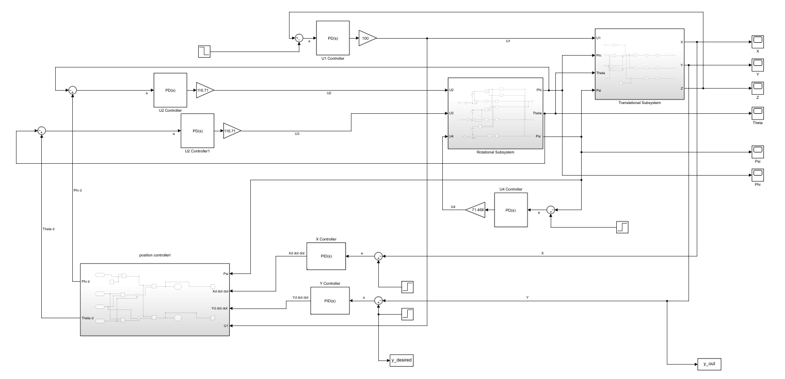
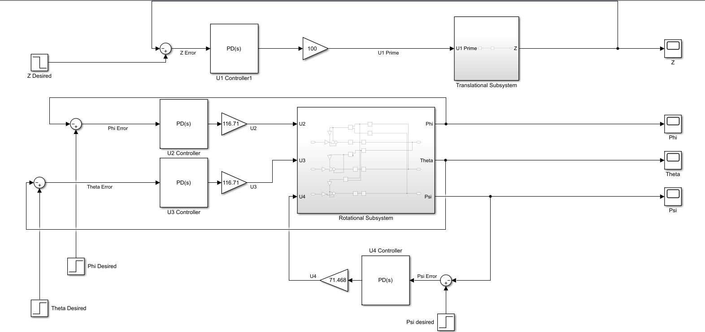
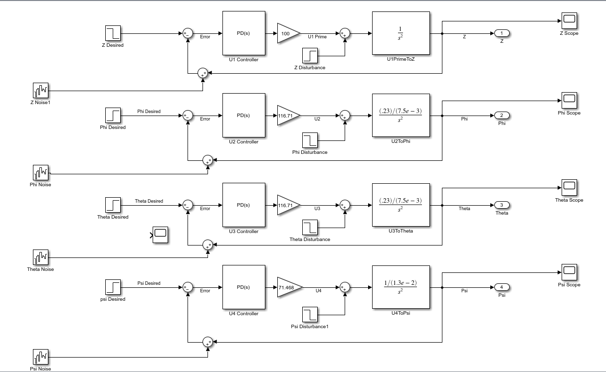

# Designing-the-Controller-of-a-Vertical-take-off-and-landing-aircraft
Designing the Controller of a Vertical take off and landing aircraft (VTOL) Using Matlab &amp; Simulink

## Overview of Systems
---
- Nonlinear System Tuned by linear PID With X & Y Dimesnsion

   

---

- Nonlinear System Tuned by linear PID Without X & Y Dimesnsion

   

---

- Tuned Linear System

   

---
Check [VTOL.pptx](https://github.com/DanesH-Abdollahi/Designing-the-Controller-of-a-Vertical-take-off-and-landing-aircraft/tree/main/VTOL.pptx) out for the presentation.

---